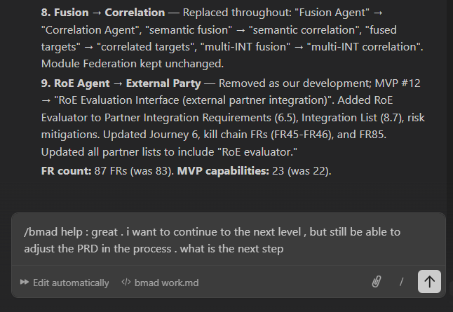

#### getting help from BMAD agent

### Updating Your PRD & Requirements
Since you want to keep the ability to revise the PRD as you go, here are the relevant workflows you can use at any time:

Edit PRD (EP) — Optional
/bmad-bmm-edit-prd
Agent: John, the Product Manager
Improve and enhance an existing PRD. Use this whenever you need to update requirements.

Validate PRD (VP) — Optional
/bmad-bmm-validate-prd
Agent: John, the Product Manager
Validate PRD is comprehensive, lean, well-organized, and cohesive. Recommended with a different LLM for an unbiased review.